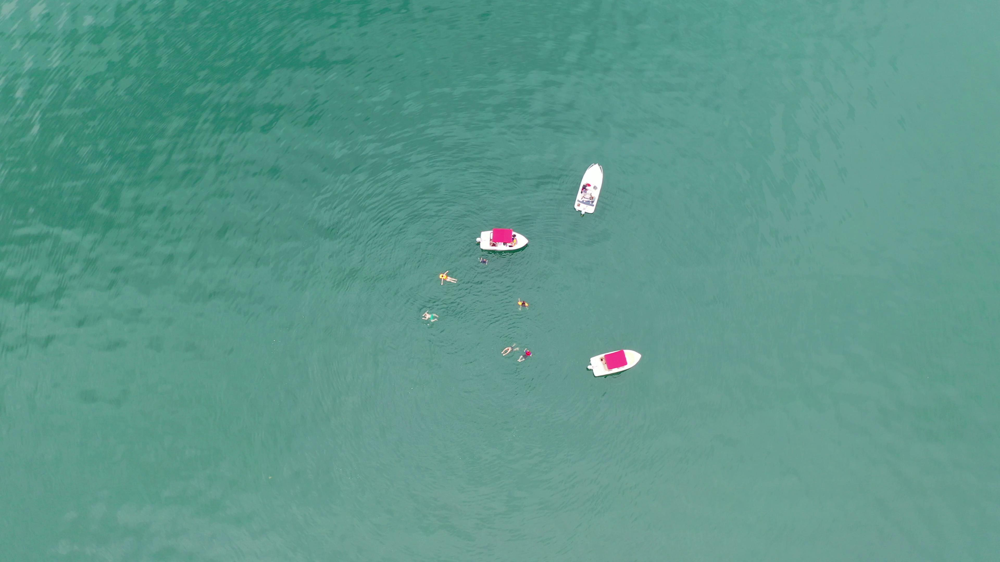
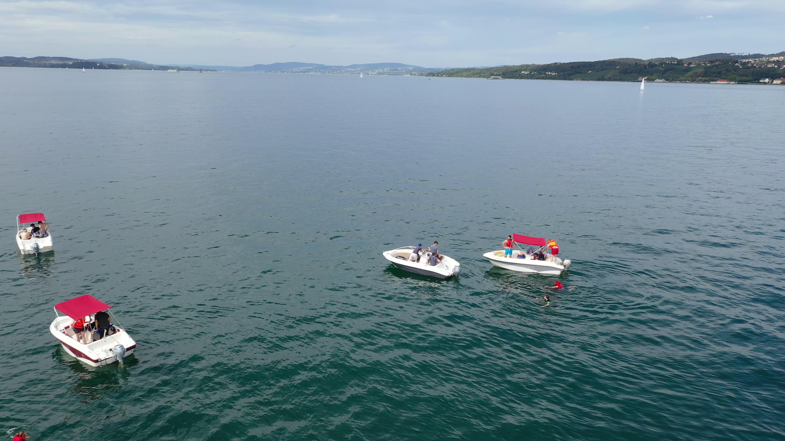
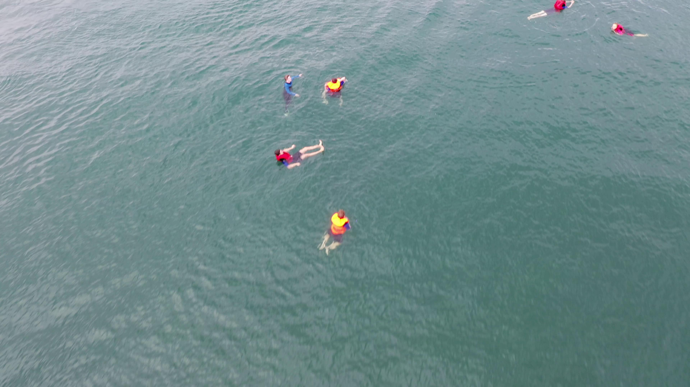
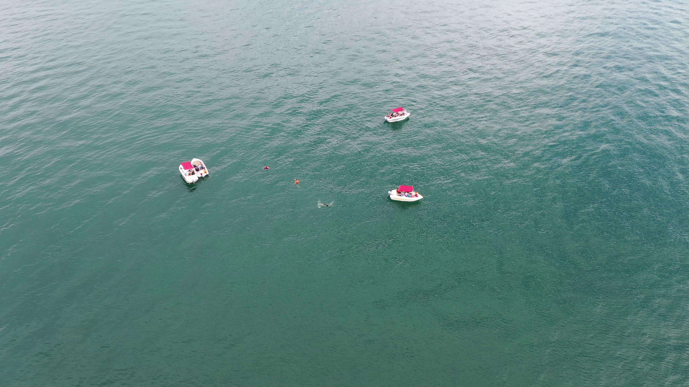

# RGB to IR Translation for Drone-Based Ocean Surveillance

## Overview

There are currently **no publicly available datasets** designed for **object detection in maritime environments at night using infrared (IR) cameras**. To address this gap, this project focuses on **translating the SeaDronesSee dataset** — which contains **drone-view RGB images of ocean scenes** — into **synthetic IR images**, as if they were captured at night using an IR camera.

The resulting translated dataset can then be used to **train object detection models** (such as YOLO) capable of performing detection tasks in **night-time maritime scenarios** using IR camera feeds.

---

## Dataset Description

### 1. **Base Dataset: SeaDronesSee**

The **SeaDronesSee dataset** is used as the primary source for this project. It consists of **aerial RGB images** captured by drones over sea areas.
It originally contains **four object classes**:

- `boat`
- `swimmer`
- `swimmer with life jacket`
- `life jacket`

For this project:

- The **"life jacket"** class was **removed**.
- The classes **"swimmer"** and **"swimmer with life jacket"** were **merged** into a single class named **"person"**.

Thus, the final dataset contains only **two categories**:

- `boat`
- `person`

Few images of the SeaDronesSee dataset is as follows

<table>
    <tr>
    <td></td>
    <td></td>
    <tr>
    <td></td>
    <td></td>
    </tr>
</table>

---

### 2. **Sampling Strategy**

To ensure practical applicability, the dataset was **sampled based on video IDs** that contained **clear and medium-altitude images** suitable for realistic night-time IR translation.

The selected video IDs are:

```
0, 5, 7, 8, 9, 12, 13, 14, 15, 18, 19, 21
```

Images from other video IDs were excluded since they contain objects that are **too small** to be realistically detected at night with IR imaging.

The **sampled SeaDronesSee dataset** used in this project is available on Kaggle:
🔗 [SeaDronesSee-MOT Sampled Dataset (Version 5)](https://www.kaggle.com/datasets/rameezakther/seadronessee-mot-sampled-dataset)

---

## RGB → IR Translation using CycleGAN

To generate infrared-style images, a **CycleGAN** model was trained to perform **RGB-to-IR image translation**.
The model was trained using:

- **Dataset A:** SeaDronesSee RGB images
- **Dataset B:** [HIT-UAV: A High-altitude Infrared Thermal Dataset](https://github.com)

A total of **2000 training images** were used from the training folders of both datasets.

The **CycleGAN training notebook** is available here:
🔗 [CycleGAN RGB2IR Training on Kaggle](https://www.kaggle.com/code/rameezakther/cycle-gan-rgb2ir-training)

The trained model is availabe here:
🔗 [CycleGAN RGB2IR Trained Model](https://www.kaggle.com/models/rameezakther/cycle-gan-for-rgb2ir/)

The **CycleGAN implementation** was adapted from the official repository:
🔗 [junyanz/pytorch-CycleGAN-and-pix2pix](https://github.com/junyanz/pytorch-CycleGAN-and-pix2pix)

---

## CycleGAN Training Summary

| **Metric**                            | **Value**        |
| ------------------------------------- | ---------------- |
| **Total Epochs**                      | 40               |
| **Total Training Duration**           | 2 days, 20:42:23 |
| **Average D<sub>A</sub> Loss**        | 0.0786           |
| **Average G<sub>A</sub> Loss**        | 0.7130           |
| **Average Cycle<sub>A</sub> Loss**    | 0.6343           |
| **Average Identity<sub>A</sub> Loss** | 0.1570           |
| **Average D<sub>B</sub> Loss**        | 0.0666           |
| **Average G<sub>B</sub> Loss**        | 0.7226           |
| **Average Cycle<sub>B</sub> Loss**    | 0.4856           |
| **Average Identity<sub>B</sub> Loss** | 0.2276           |

---

## IR Dataset Generation

After training, the CycleGAN model was used to **translate the SeaDronesSee RGB images into IR-style images**.
Each translated image has a resolution of **256 × 256 pixels**.
Consequently, the **bounding box annotations were rescaled** to match this dimension.

The **notebook used for translation**:
🔗 [SeaDronesSee RGB → IR Conversion using CycleGAN](https://www.kaggle.com/code/rameezakther/seadronesee-rgb2ir-conversion-using-cycle-gan)

The **final IR-translated dataset** is available here:
🔗 [SeaDronesSee IR Translated Dataset](https://www.kaggle.com/datasets/rameezakther/seadronessee-ir-translated-dataset)

Some of the IR translated images is displayed below

<table>
    <tr>
    <td></td>
    <td></td>
    <tr>
    <td></td>
    <td></td>
    </tr>
</table>

---

Perfect 👍 You can extend your report section to include the model configuration, training duration, and performance results in a professional **Markdown** format like this:

---

## Object Detection using YOLOv8

Using the **Ultralytics YOLOv8m** model, training was conducted on the **IR-translated SeaDronesSee dataset** to detect two target classes:

- `boat`
- `person`

The model was trained using the **Ultralytics Python API**, with all preprocessing steps ensuring compatibility with the **256×256** input dimensions. The dataset used was the IR-translated version of the SeaDronesSee dataset, created using CycleGAN.

### ⚙️ Training Configuration

| Parameter              | Value                        |
| ---------------------- | ---------------------------- |
| **Model**              | YOLOv8m                      |
| **Epochs**             | 100                          |
| **Batch Size**         | 32                           |
| **Image Size**         | 256×256                      |
| **Optimizer**          | SGD (default in Ultralytics) |
| **Learning Rate**      | 0.01 (default)               |
| **Device**             | NVIDIA Tesla T4 (15GB VRAM)  |
| **Framework**          | Ultralytics YOLOv8.3.217     |
| **Python Version**     | 3.12.12                      |
| **PyTorch Version**    | 2.8.0+cu126                  |
| **Parameters (total)** | 25,840,918                   |
| **Layers**             | 92                           |

### Training Results

| Metric            | `all` | `person` | `boat` |
| :---------------- | :---: | :------: | :----: |
| **Precision (P)** | 0.764 |  0.786   | 0.742  |
| **Recall (R)**    | 0.898 |  0.858   | 0.938  |
| **mAP@0.5**       | 0.828 |  0.828   | 0.828  |
| **mAP@0.5:0.95**  | 0.519 |  0.392   | 0.645  |

**Total validation images:** 1,574
**Total instances detected:** 11,936
**Inference speed:** ~2.1 it/s
**Post-processing time:** ~1.5 ms per image

The result graph is as follows


Some inferenced images are as follows

<table>
    <tr>
    <td></td>
    <td></td>
    <tr>
    <td></td>
    <td></td>
    </tr>
</table>

The trained model is availabe here:
🔗 [YoloV8m Trained Model](https://www.kaggle.com/models/rameezakther/yolov8m-model-trained-on-ir-seadronessee-dataset)

---

## Summary

This project demonstrates a **complete pipeline** for enabling **night-time object detection in marine environments**:

1. Sampling and preparing the SeaDronesSee dataset.
2. Translating RGB images into IR domain using CycleGAN.
3. Scaling annotations to match translated images.
4. Training a YOLOv8 model for object detection on the translated IR dataset.

The resulting model can be deployed for **real-time surveillance tasks** using **IR camera feeds** from drones during **low-light or night-time conditions**.

---

## References

1. **SeaDronesSee Dataset** – [https://seadronessee.cs.uni-tuebingen.de/dataset](https://seadronessee.cs.uni-tuebingen.de/dataset)
2. **HIT-UAV Infrared Dataset** – [https://www.kaggle.com/datasets/pandrii000/hituav-a-highaltitude-infrared-thermal-dataset](https://www.kaggle.com/datasets/pandrii000/hituav-a-highaltitude-infrared-thermal-dataset)
3. **CycleGAN Original Repo** – [https://github.com/junyanz/pytorch-CycleGAN-and-pix2pix](https://github.com/junyanz/pytorch-CycleGAN-and-pix2pix)
4. **Ultralytics YOLOv8** – [https://github.com/ultralytics/ultralytics](https://github.com/ultralytics/ultralytics)

---


